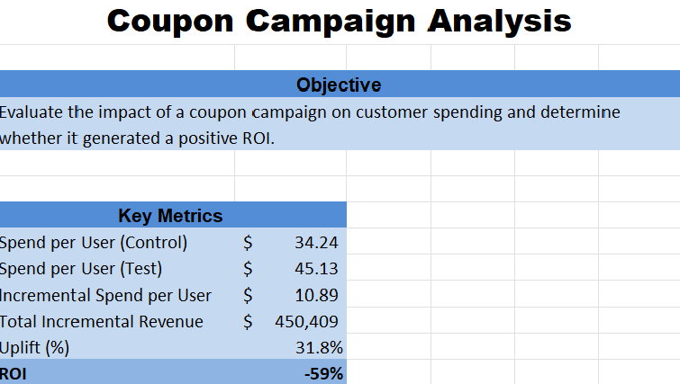
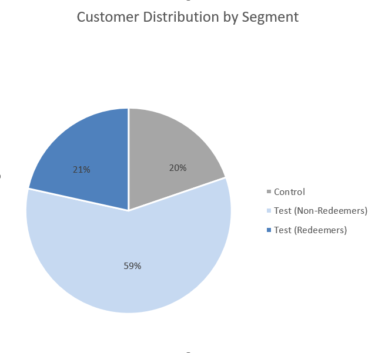
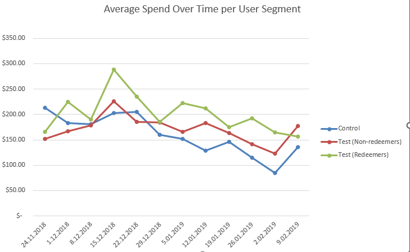
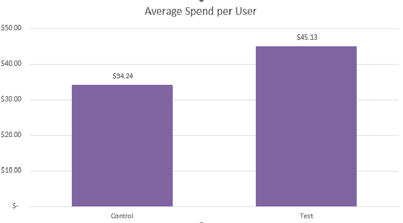
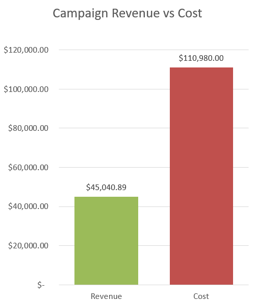

# Coupon Campaign Analysis

Analysis of a coupon campaign to evaluate its impact on customer spending and overall profitability.

## Dashboard

## Business Question

The goal of this project was to determine whether a coupon campaign increased customer spending and whether that increase translated into a positive return on investment (ROI).

## Dataset Overview

The analysis was based on:

- User-level transaction data
- Customer segmentation into Control and Test groups
- Identification of coupon redeemers within the Test group

## Analytical Approach

### 1. Customer Segmentation

Users were divided into:
- Control
- Test (Non-Redeemers)
- Test (Redeemers)

---

### 2. Spend Over Time

Weekly spend trends were analyzed across all segments to understand behavioral differences.

---

### 3. Incremental Impact

To ensure fair comparison, **average spend per user** was used instead of total spend.

Key calculations:

- Incremental Spend per User = Test - Control  
- Uplift (%) = (Test - Control) / Control  
- Total Incremental Revenue = Incremental Spend × Test Users  

---

### 4. ROI Analysis

- Revenue = Incremental Revenue × Take Rate (10%)  
- Cost = Coupon Value × Redeemers  
- ROI = (Revenue - Cost) / Cost  

---

## Key Results

- Spend per User (Control): 34.24 USD  
- Spend per User (Test): 45.13 USD  
- Incremental Spend per User: 10.89 USD  
- Uplift: 31.8%  
- Total Incremental Revenue: 450,409 USD  
- Revenue: 45,040.89 USD  
- Cost: 110,980.00 USD  
- ROI: -59%  

---

## Key Insights

- The campaign significantly increased customer spending (+32%)  
- Most users in the Test group did not redeem the coupon  
- Despite higher engagement, the campaign was not profitable  
- The cost of the campaign exceeded generated revenue  

---

## Conclusion

The campaign successfully increased customer spend but resulted in a negative ROI.

This suggests that the campaign has potential, but requires optimization — for example:
- adjusting coupon value  
- improving targeting  
- testing alternative incentive strategies  

---

## Tools Used

- Microsoft Excel  
- Pivot Tables  
- Data Analysis & Visualization  

---

## Project File

- Coupon-Campaign-Analysis.xlsx
